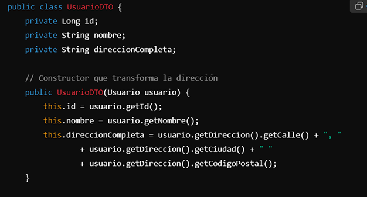
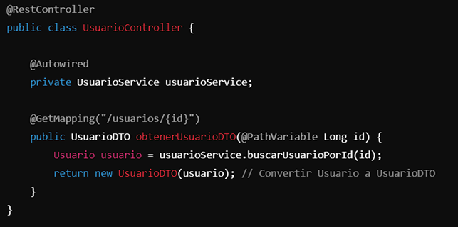

# 1.	Introducción
Conforme vayas avanzando en la clase de Spring Web, irás implementando una aplicación de backend de una tienda online. Esta aplicación tendrá dos caras:  
* El backoffice. Servirá para gestionar la tienda:
  * Los productos
  * Los usuarios 
  * Las estadísticas

* El frontoffice. Será la cara que usen los usuarios:
  * Pedidos
# 2.	Funcionalidades generales
a)  La aplicación será multidioma, soportando el castellano y el inglés. El idioma se cambiará mediante el queryParam lang  
b)	También tendrá la configuración de CORS correctamente establecida para que se puedan hacer peticiones desde el navegador.  
c)	El proyecto debe de contener los siguientes paquetes para albergar los distintos tipos de piezas que vas a crear:
* controller 
* service (cada servicio con su interfaz y su respectiva implementación)
* model 
* dto 
* configuration 
* enum  

d)	Añade alguna validación a algún modelo / DTO  
e)	Las búsquedas deben de ir paginadas. Devuelve los resultados totales de la búsqueda en la cabecera X-TOTAL-COUNT
# 3.	Filtros
La aplicación contará con un filtro que interceptará todas las solicitudes dirigidas al endpoint de búsqueda de productos. Este filtro capturará la respuesta y usará el servicio de estadísticas para actualizar la cantidad de búsquedas realizadas para cada producto devuelto en la respuesta.  

Algunos consejos para implementar correctamente el filtro:
* Usa este filtro como base: [Filtro](src/main/java/com/laberit/sina/bootcamp/modulo3/spring_web/filter/Filter.java)   
* El método getRequestURI de la clase HttpServletRequest te da el path del endpoint que ha desencadenado la ejecución del filtro. Puedes usarlo para determinar si hay que ejecutar el filtro o no.
# 4.	Modelos
Tu aplicación tendrá los siguientes modelos:
## 4.1.	Product
Es el modelo para el producto. Aquellas características que dependan del idioma van en otro modelo, productDetail. Un product tiene tantos productDetail como idiomas soporte la aplicación.  

Debe de tener los siguientes campos:
* id - Long 
* code - String 
* price - Double 
* stock - Long 
* productDetail – ProductDetail[]
## 4.2.	ProductDetail
Son las características del producto que dependen del idioma. Hay una instancia de esta clase por producto y por idioma.  

Debe de tener los siguientes campos:
* id – Long 
* name – String 
* description – String 
* lang – String
## 4.3.	ProductStatistic
Registra una serie de estadísticas sobre los productos.  

Debe de tener los siguientes campos:
* id – Long 
* count – Long 
* product - Product
## 4.4.	 User
Los usuarios de la aplicación web. Pueden ser administradores o clientes. Los administradores tendrán acceso al backoffice y al frontoffice, los clientes solo al frontoffice.  

Debe de tener los siguientes campos:
* id – Long 
* name – String 
* email – String 
* role – Enum<ADMIN,CLIENT>
## 4.5.	Order
Es el pedido.  

Debe de tener los siguientes campos:
* id – Long 
* producto – Product 
* user – User 
* date – Date 
* quantity – int
# 5.	DTO’s
Un DTO (Data Transfer Object) es un patrón de diseño que sirve para transferir datos entre aplicaciones. En el ámbito web, el backend no suele enviar en las respuestas los modelos tal cual, sino que los transforma en representaciones más sencillas y adaptadas para el cliente. Estas representaciones se llaman DTO. Por ejemplo, en el caso del producto, el modelo tiene los detalles por separado, pero un frontend va a querer toda la información junta y sólo en el idioma solicitado.

Los DTO se suelen transformar en ambos sentidos: de DTO a Modelo y de Modelo a DTO.  

Para convertir un modelo a DTO se puede crear una instancia del DTO y copiarle toda la información del modelo, transformando todo aquello que sea necesario. Toda esta lógica puede estar en el constructor. Por ejemplo, imagina que tienes las siguientes dos clases:

| **Dirección** |        |
|---------------|--------|
| Nombre        | Tipo   |
| calle         | Long   |
| ciudad        | String |
| codigoPostal  | String |

| **Usuario**  |           |
|--------------|-----------|
| Nombre       | Tipo      |
| calle        | Long      |
| ciudad       | String    |
| codigoPostal | Direccion |

El DTO de usuario podría ser así:

| **UsuarioDto**    |        |
|-------------------|--------|
| Nombre            | Tipo   |
| Id                | Long   |
| nombre            | String |
| direccionCompleta | String |

El constructor de UsuarioDTO podría recibir un Usuario y tener la lógica de transformación de cada uno de sus atributos:  
  

Los DTO los suele devolver el controlador, por lo que es ahí donde se hace la conversión, justo después de haber obtenido el modelo de los servicios:  
  

Teniendo esto en cuenta, implementa este DTO y la transformación únicamente en el sentido Modelo ->  DTO
## 5.1.	ProductDTO
El DTO de producto no incluirá el stock, ya que esa información no la necesita el cliente, e incluirá directamente el nombre y la descripción del producto en el idioma de la petición.  

Tendrá los siguientes atributos:
* id - Long 
* code - String 
* price – Double 
* name – String 
* description – String  

El constructor deberá de recibir un Product y el Locale como String para poder cumplimentar sus atributos.
# 6.	Casos de uso
## 6.1.	Productos
* CRUD Producto
  * Crear, Actualizar y Eliminar serán para el backoffice 
  * Obtener por id será para el frontoffice
* Listar productos filtrando por (frontoffice):
  * Categoría (exacta)
  * Nombre (contiene)

Este endpoint es el único que devolverá el DTO
## 6.2.	Pedidos
* Crear Pedido (frontoffice)
* Filtrar pedidos (frontoffice):
  * Usuario 
  * Producto 
  * Fecha desde y hasta

## 6.3.	Estadísticas
* Crear o actualizar estadística. Si no existe la estadística para el producto, la crea. Si no, la actualiza. Esta funcionalidad la invoca el filtro
  * Este CU no debe de tener endpoint. Solo tendrá su parte en el servicio, y será lo que sea inyectado en el filtro 
  * Obtener estadísticas (backoffice)
# 7.	Consejos para realizar el ejercicio
* Implementa primero el CRUD de producto. 
* Luego los CU del frontoffice 
* Luego CORS y multidioma 
* Luego mete alguna validación 
* Luego la paginación (sin la cabecera X-TOTAL-COUNT) y el endpoint de listar productos 
* Luego la cabecera en aquellos endpoints que paginen 
* Luego el filtro y toda la parte de estadísticas 
